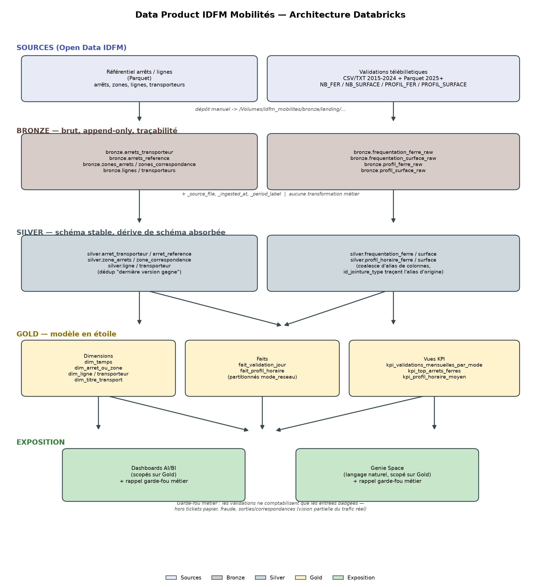

# Data Product Île-de-France Mobilités

Data Product Databricks construit sur les données Open Data d'Île-de-France Mobilités, pour donner aux
entreprises de transport (SNCF, RATP, Veolia, Keolis, Bus Lacroix, etc.) et aux mairies d'Île-de-France une
vision globale de l'usage des transports en commun et vérifier l'alignement entre l'offre et la fréquentation
réelle.

Repo : `idfm-mobilites-databricks`

---

## 1. Contexte et objectifs du projet

### 1.1 Origine

Projet interne proposé par le management, dans la continuité d'un projet précédent ("Data Product ENEDIS —
Ouvrages du réseau de distribution électrique"). Différence majeure cette fois : le management (le manager et
Baptiste) joue un rôle de **Product Owner purement fonctionnel**, sans connaissance technique de Databricks. La
responsabilité de la conception technique — architecture, ingestion, modélisation, exposition — ainsi que
l'organisation des ateliers de cadrage technique, revient entièrement à l'équipe technique (moi, dans ce
projet).

### 1.2 Besoins métier exprimés

1. Partager le **référentiel de données des transports d'Île-de-France**, pour pouvoir à terme le croiser avec
   d'autres référentiels (sécurité, qualité de l'air, etc.).
2. Partager les **données de fréquentation des arrêts** depuis 2015, en mutualisant transport ferré (Métro,
   RER, Transilien) et transport de surface (bus, tram).
3. Calculer des **KPI** croisant fréquentation et référentiel sur différents axes (temps, arrêts du réseau) et
   niveaux d'agrégation (tranche horaire, jour, mois, zone d'arrêts, zone de correspondance).
4. Afficher ces KPI dans des **dashboards** construits sur la plateforme.
5. Permettre l'**analyse en langage naturel** via l'IA générative de Databricks (Genie).

### 1.3 Sources de données

Toutes les données proviennent du portail Open Data d'Île-de-France Mobilités
(`data.iledefrance-mobilites.fr`), complétées par la documentation technique IDFM (PRIM —
`prim.iledefrance-mobilites.fr`) :

- **Référentiel des arrêts et lignes** (doc `2023_idfm_referentiels.pdf`, v3.9, septembre 2023).
- **Données de validation télébilletiques** (doc `Donnees_de_validation.pdf`).

### 1.4 Gouvernance du projet

- Documents de travail centralisés sur un espace SharePoint dédié.
- Backlog géré dans le projet Jira existant `DatabricksGIS`.
- Le présent dépôt contient le code technique (notebooks Databricks) et le classeur de cadrage
  (`Atelier_cadrage_questions_IDFM.xlsx`) qui recense toutes les questions ouvertes à trancher avec le
  management avant industrialisation complète.

---

## 2. Les données

### 2.1 Référentiel des arrêts et lignes

Reçu sous forme d'un zip (`Données de référentiels.zip`) contenant 6 fichiers Parquet + la doc PDF :

| Fichier | Lignes | Objet référentiel |
|---|---|---|
| `arrets-transporteur.parquet` | 48 906 | Arrêt Transporteur — objet "terrain" (poteau, quai, abribus...) |
| `arrets.parquet` | 37 879 | Arrêt de référence — objet communautaire construit à partir des arrêts transporteurs |
| `zones-d-arrets.parquet` | 17 933 | Zone d'Arrêts — cohérence commerciale/géographique (monomodale) |
| `zones-de-correspondance.parquet` | 15 466 | Zone de correspondance — multimodale, correspondances piétonnes implicites |
| `referentiel-des-lignes.parquet` | 2 139 | Lignes commerciales actives et prochainement actives |
| `liste-transporteurs.parquet` | 61 | Transporteurs exploitant les lignes |

**Hiérarchie des objets arrêts** (du plus fin au plus large) : Arrêt Transporteur → Arrêt de référence → Zone
d'Arrêts → Zone de correspondance → Pôle d'échange (facultatif, lieux à visibilité nationale/internationale).
Les fichiers reçus portent déjà les clés étrangères de cette hiérarchie (`arrid`, `zdaid`, `zdcid`) ; les
fichiers `acces.csv`, `poles-d-echange.csv`, `relations.csv` et `relations-acces.csv` documentés par IDFM
n'ont pas été fournis mais ne sont pas bloquants pour cette raison.

#### Schéma `arrets-transporteur.parquet`
```
artid, artversion, artcreated, artchanged, fournisseurid, fournisseurname, artname,
artxepsg2154, artyepsg2154, arrid, arttype, artfarezone, artaccessibility,
artaudiblesignals, artvisualsigns, arttown, artpostalregion, privatecode, publiccode,
artgeopoint (binary, geo)
```

#### Schéma `arrets.parquet`
```
arrid, arrversion, arrcreated, arrchanged, arrname, arrtype, arrxepsg2154, arryepsg2154,
arrtown, arrpostalregion, arraccessibility, arraudiblesignals, arrvisualsigns, arrfarezone,
zdaid, arrgeopoint (binary, geo)
```

#### Schéma `zones-d-arrets.parquet`
```
zdaid, zdaversion, zdacreated, zdachanged, zdaname, zdaxepsg2154, zdayepsg2154,
zdcid, zdapostalregion, zdatown, zdatype
```

#### Schéma `zones-de-correspondance.parquet`
```
zdcid, zdcversion, zdccreated, zdcchanged, zdcname, zdcxepsg2154, zdcyepsg2154,
zdctown, zdcpostalregion, zdctype
```

#### Schéma `referentiel-des-lignes.parquet`
```
id_line, name_line, shortname_line, transportmode, transportsubmode, type, operatorref,
operatorname, additionaloperators, networkname, colourweb_hexa, textcolourweb_hexa,
colourprint_cmjn, textcolourprint_hexa, accessibility, audiblesigns_available,
visualsigns_available, id_groupoflines, shortname_groupoflines, notice_title, notice_text,
picto, valid_fromdate, valid_todate, status, privatecode, air_conditioning, id_bus_contrat
```

#### Schéma `liste-transporteurs.parquet`
```
operatorname, operatorref, housenumber, street, addressline1, town, postcode,
postcodeextension, phone, url, furtherdetails, contactperson, logo, email
```

Identification d'une ligne (cf. doc) : `ID_Line` (identifiant pérenne), `Name_Line`/`ShortName_Line` (nom
commercial), `ExternalCode_Line` (reconstructible via `[PrivateCode]":"[ShortName_Line]`, non présent tel quel
dans le fichier).

### 2.2 Données de validation télébilletiques (fréquentation)

Reçues sous forme d'un zip (`Données de validations.zip`), couvrant **2015 à 2025**, sur deux familles de
fichiers :

- `Données historiques 2015 - 2024 au format CSV ou TXT/` : **108 fichiers** CSV/TXT, un par semestre ou
  trimestre selon la période et le dataset.
- `Données récentes à partir 2025 au format parquet/` : **16 fichiers** Parquet, un par trimestre.

4 jeux de données, croisés avec 2 modes de réseau :

| Dataset | Grain | Réseau |
|---|---|---|
| `NB_FER` | jour × arrêt × titre de transport | Ferré (Métro, RER, Transilien — **le T4 est considéré ferré**) |
| `NB_SURFACE` | jour × ligne × titre de transport | Surface (bus, tram) |
| `PROFIL_FER` | catégorie de jour × tranche horaire × arrêt | Ferré |
| `PROFIL_SURFACE` | catégorie de jour × tranche horaire × ligne | Surface |

Points clés de la doc IDFM (`Donnees_de_validation.pdf`) :
- Origine : badges Navigo/Imagine R/Améthyste/TST/FGT aux valideurs, anonymisés, ~2,7 milliards de validations/an.
- **Ne comptabilisent pas** : tickets magnétiques, usagers ne validant pas, fraudeurs, sorties/correspondances
  → vision **partielle** du trafic, à rappeler dans toute restitution.
- `NB_VALD` est tronqué en texte `"Moins de 5"` quand la valeur réelle est < 5 (anonymisation RGPD).
- Catégories de jour : `JOHV` (jour ouvré hors vacances), `SAHV` (samedi hors vacances), `JOVS` (jour ouvré en
  vacances), `SAVS` (samedi en vacances), `DIJFP` (dimanche/jour férié/pont).
- Catégories de titre : `IMAGINE R`, `NAVIGO`, `AMETHYSTE`, `TST`, `FGT`, `AUTRE TITRE`, `NON DEFINI`.
- Jointure vers le référentiel via `ID_REFA_LDA` (arrêt) et `ID_GroupOfLines` (ligne administrative — peut
  regrouper plusieurs lignes commerciales).

#### Schéma "documenté" `NB_FER` (2015, tel que reçu)
```
JOUR; CODE_STIF_TRNS; CODE_STIF_RES; CODE_STIF_ARRET; LIBELLE_ARRET; ID_REFA_LDA; CATEGORIE_TITRE; NB_VALD
```

#### Schéma "documenté" `NB_SURFACE` (2015, tel que reçu)
```
JOUR  CODE_STIF_TRNS  CODE_STIF_RES  CODE_STIF_LIGNE  LIBELLE_LIGNE  ID_GROUPOFLINES  CATEGORIE_TITRE  NB_VALD
```

#### Schéma "documenté" `PROFIL_FER` (2015, tel que reçu)
```
CODE_STIF_TRNS; CODE_STIF_RES; CODE_STIF_ARRET; LIBELLE_ARRET; ID_REFA_LDA; CAT_JOUR; TRNC_HORR_60; pourc_validations
```

#### Schéma "documenté" `PROFIL_SURFACE` (2015, tel que reçu)
```
CODE_STIF_TRNS; CODE_STIF_RES; CODE_STIF_LIGNE; LIBELLE_LIGNE; ID_GROUPOFLIGNE; CAT_JOUR; TRNC_HORR_60; pourc_validations
```

**⚠️ Ces schémas ne sont pas stables sur 10 ans** — cf. section 4 "Dérive de schéma observée" ci-dessous, qui a
été le principal défi technique du projet.

### 2.3 Documentation source

| Fichier | Contenu |
|---|---|
| `data/.../2023_idfm_referentiels.pdf` | Référentiel arrêts/lignes IDFM v3.9 (septembre 2023) |
| `data/.../Donnees_de_validation.pdf` | Données de validation télébilletiques, doc PRIM |

---

## 3. Architecture

### 3.1 Schéma d'ensemble



Flux : dépôt manuel des sources dans `/Volumes/idfm_mobilites/bronze/landing/...` → Bronze (brut,
append-only) → Silver (schéma stable, dérive de schéma absorbée) → Gold (modèle en étoile) →
Dashboards AI/BI et Genie Space, tous deux scopés sur Gold avec le garde-fou métier rappelant la
portée partielle des données de validation.

### 3.2 Unity Catalog

```
Catalogue : idfm_mobilites
├── bronze    (brut, append-only)
├── silver    (normalisé, schéma stable)
├── gold      (modèle en étoile)
└── sandbox   (exploration libre)
```

Volume de dépôt manuel : `/Volumes/idfm_mobilites/bronze/landing/` avec 4 sous-dossiers
(`referentiel_arrets/`, `referentiel_lignes/`, `frequentation/historique/`, `frequentation/recent/`).

### 3.3 Pourquoi Bronze ne fait aucune transformation

Les fichiers de fréquentation changent radicalement de format dans le temps (séparateur, casse, noms de
colonnes — cf. section 4). Plutôt que de durcir une hypothèse de schéma figé dans la couche d'ingestion,
Bronze charge "as-is" et type tout en `string`, pour ne jamais faire planter l'ingestion sur une variation de
format. Toute la réconciliation se fait en Silver, qui peut être rejouée/corrigée sans avoir à ré-ingérer les
sources.

### 3.4 Pourquoi Silver utilise un coalesce d'alias plutôt qu'une table de mapping par date

Le choix initial était une table `silver_config.schema_mapping` pilotée par plage de dates (`valid_from` /
`valid_to`) pour faire correspondre chaque alias de colonne à un nom cible. Ce choix a été abandonné une fois
les dates de bascule exactes investiguées : elles ne sont pas alignées entre les 4 datasets (ex: la colonne clé
de `NB_FER` change de nom à une date différente de celle de `PROFIL_FER`, cf. section 4), ce qui aurait rendu
la table de mapping complexe et fragile à maintenir.

À la place, chaque champ logique est calculé par un `coalesce()` de tous les alias de colonnes connus. Comme
Bronze fusionne les schémas (`mergeSchema`) de tous les fichiers ingérés, chaque ligne ne renseigne qu'un seul
des alias pour sa période — les autres valent `NULL`. Le `coalesce` sélectionne donc naturellement la bonne
valeur, sans avoir besoin de connaître la date de bascule au jour près. Un contrôle qualité en fin de notebook
Silver détecte si une ligne n'a été couverte par aucun alias connu (signe qu'un nouvel alias est apparu côté
IDFM, non géré encore).

### 3.5 Modèle en étoile (Gold)

- **`dim_arret_ou_zone`** unifie `silver.arret_reference` et `silver.zone_correspondance` avec un discriminant
  `granularite` (`ARRET` ou `ZDC_A_CONFIRMER`), à cause d'une ambiguïté non résolue détaillée en section 4.
- **`dim_ligne`** est au grain "ligne administrative" (`id_groupe_lignes`), car c'est la clé portée par les
  données de validation — pas le grain "ligne commerciale" (`id_line`) du référentiel des lignes.
- **`fait_validation_jour`** et **`fait_profil_horaire`** unifient ferré et surface dans une seule table
  partitionnée par `mode_reseau`, avec une colonne `id_point` qui pointe soit vers un arrêt/zone (ferré) soit
  vers une ligne administrative (surface) selon le mode.

### 3.6 Mise en place des données (landing zone)

Les données sources ne sont pas versionnées dans ce repo (volumineuses et soumises à la licence
IDFM) — elles doivent être déposées manuellement dans le Volume Unity Catalog `bronze.landing`
avant de lancer les notebooks d'ingestion.

#### Prérequis

- Un workspace Azure Databricks avec Unity Catalog activé (Premium tier).
- Le notebook `databricks/00_setup/00_create_catalog_schemas.py` exécuté une fois : il crée le
  catalogue `idfm_mobilites`, ses schémas (`bronze`, `silver`, `silver_config`, `gold`, `sandbox`)
  et le volume de dépôt `idfm_mobilites.bronze.landing` avec son arborescence.

#### Arborescence attendue dans le volume

```
/Volumes/idfm_mobilites/bronze/landing/
├── referentiel_arrets/
│   ├── arrets.parquet
│   ├── arrets-transporteur.parquet
│   ├── zones-d-arrets.parquet
│   └── zones-de-correspondance.parquet
├── referentiel_lignes/
│   ├── liste-transporteurs.parquet
│   └── referentiel-des-lignes.parquet
└── frequentation/
    ├── historique/   <- tous les *.csv / *.txt 2015-2024 (NB_FER, NB_SURFACE, PROFIL_FER, PROFIL_SURFACE)
    └── recent/        <- tous les *.parquet 2025+ (validations-reseau-ferre-*, validations-sur-le-reseau-ferre-*)
```

#### Procédure de dépôt (interface Databricks)

1. Dans le workspace Databricks, ouvrir **Catalog** → `idfm_mobilites` → `bronze` → `landing`.
2. Pour chaque sous-dossier (`referentiel_arrets`, `referentiel_lignes`, `frequentation/historique`,
   `frequentation/recent`), cliquer sur **"Upload to this volume"** et sélectionner les fichiers
   correspondants depuis :
   - `data/Données de référentiels.zip` (à décompresser au préalable) → `referentiel_arrets/` et
     `referentiel_lignes/`
   - `data/Données de validations.zip` → `frequentation/historique/` (CSV/TXT 2015-2024) et
     `frequentation/recent/` (Parquet 2025+)
3. Une fois tous les fichiers déposés, exécuter dans l'ordre :
   `01_bronze/*` → `02_silver/*` → `03_gold/*`.

> Alternative scriptée : les mêmes fichiers peuvent être copiés par programmation avec
> `dbutils.fs.cp(source, f"/Volumes/idfm_mobilites/bronze/landing/...")` depuis un notebook ayant
> accès au stockage source, pour automatiser ce dépôt plutôt que de l'uploader manuellement.

---

## 4. Difficultés rencontrées et bugs corrigés

Cette section documente les problèmes réels trouvés en inspectant les données et en exécutant les notebooks
sur un workspace Databricks — pas des risques théoriques.

### 4.1 Dérive de schéma sur 10 ans (le défi principal)

En inspectant les 124 fichiers réels de fréquentation, plusieurs renommages de colonnes ont été identifiés,
à des dates différentes selon le dataset :

| Champ logique | Dataset | Alias observés selon la période |
|---|---|---|
| clé arrêt | `NB_FER` | `ID_REFA_LDA` (2015→2023S1) → `ID_ZDC` (2023S2→2024) → `ida` (2025, en `double`) |
| clé arrêt | `PROFIL_FER` | `ID_REFA_LDA` (2015→2022S1) → `lda` (2022S2→2023S1) → `ID_ZDC` (2023S2→2024) → `ida` (2025) |
| clé ligne | `NB_SURFACE` | `ID_GROUPOFLINES` (stable sur toute la période) |
| clé ligne | `PROFIL_SURFACE` | `ID_GROUPOFLIGNE` (typo IDFM, stable y compris en 2025) |
| % validations | `PROFIL_FER`/`PROFIL_SURFACE` | `pourc_validations` (jusqu'à 2024S1) → `Pourcentage_validations` (à partir de 2024T3) |

Autres variations transverses constatées :
- **Séparateur** : `;` pour les tout premiers fichiers (2015S1), tabulation pour quasiment tout le reste.
- **Casse des en-têtes** : MAJUSCULES dans l'historique CSV/TXT, minuscules dans les Parquet 2025.
- **Format de date** : `dd/MM/yyyy` (2015-2023) puis `dd/MM/yy` année sur 2 chiffres (2024+).
- **Nombres avec espaces** : `"2 093"` au lieu de `2093` dans certains fichiers.
- **Texte dans une colonne numérique** : `"Moins de 5"` à la place d'un entier (anonymisation RGPD).
- **Libellés de titre recasés** : `AMETHYSTE` → `Amethyste`, `AUTRE TITRE` → `Autres titres`.
- **Colonnes en trop ponctuelles** : `CODE_TLB_TRNS/RES/LIGN` apparues une seule fois sur `2024_T4_PROFIL_SURFACE`,
  non documentées, ignorées en Silver.
- **Nom de fichier sans année** : `validations-reseau-ferre-profils-horaires-par-jour-type-1er-trimestre.parquet`
  (un seul fichier sur 124), traité via un `default_year=2025` explicite plutôt qu'une erreur bloquante.

Résolution : logique de classification par mots-clés (`classify_dataset`) et d'extraction de période
(`extract_period`) dans `01_bronze/02_bronze_frequentation.py`, **validée à 100% sur les 124 fichiers réels**
avant tout déploiement (script de test ad hoc, supprimé après validation — la commande utilisée est conservée
en section 5).

### 4.2 Ambiguïté `ID_ZDC` non résolue (point ouvert, pas un bug)

`ID_ZDC` pourrait être soit un simple renommage de `ID_REFA_LDA` (même référentiel visé : l'Arrêt de
référence), soit un changement réel de granularité vers la **Zone De Correspondance**. Ce n'est pas tranché.
Plutôt que de fusionner les deux cas aveuglément, une colonne `id_jointure_type` trace l'alias d'origine
(`ARRET`, `ZDC_A_CONFIRMER`, `INCONNU_2025`), et `gold.dim_arret_ou_zone` unifie les deux référentiels
possibles avec un discriminant `granularite`. Question posée formellement dans le classeur de cadrage,
marquée bloquante pour fiabiliser les KPI sur 2023+.

### 4.3 Bugs rencontrés à l'exécution réelle sur Databricks

Ces corrections ont été apportées après un premier run sur un vrai cluster (le code initial, jamais exécuté,
contenait des hypothèses trop optimistes sur la propreté des données) :

1. **Encodage UTF-16 sur certains fichiers historiques** (2015-2016 notamment) : la lecture plantait sans
   détection explicite de l'encodage. Ajout de `detect_encoding()` qui lit les 4 premiers octets du fichier
   pour détecter un BOM UTF-16 (`\xff\xfe` ou `\xfe\xff`), sinon suppose UTF-8.
2. **`mergeSchema` en échec sur les Parquet 2025** : les types différaient légèrement d'un trimestre à
   l'autre (ex: `pourcentage_validations` en `double` sur un fichier, en texte sur un autre). Ajout de
   `cast_all_to_string()` pour uniformiser tous les Parquet récents en string avant écriture, cohérent avec le
   choix déjà fait pour l'historique CSV/TXT.
3. **`NB_VALD` avec suffixe décimal parasite** (ex: `"71324.0"` au lieu de `"71324"`) : le cast direct en
   `long` échouait. Cast intermédiaire en `double` puis `long` (`cleaned.cast("double").cast("long")`).
4. **`artversion`/`arrversion`/`zdaversion`/`zdcversion` non castables en `int`** de façon stricte (valeurs
   inattendues dans certaines lignes) : remplacement de `.cast("int")` par `try_cast(... as int)`, qui renvoie
   `NULL` au lieu de lever une exception en mode ANSI.
5. **`pourc_validations`/`Pourcentage_validations` au format `12,34` (virgule décimale)** au lieu de `12.34` :
   ajout de `F.regexp_replace(pourcentage, ",", ".")` avant le `cast("double")`.
6. **Colonnes `JOUR`/`jour` dupliquées après `mergeSchema`** : les en-têtes historiques étant en MAJUSCULES et
   les Parquet 2025 déjà en minuscules, Spark les traitait comme deux colonnes distinctes. Ajout de
   `lowercase_columns()` appliqué systématiquement à l'ingestion Bronze (normalisation technique, pas
   métier).
7. **Parsing de date sur deux formats simultanés** (`dd/MM/yyyy` vs `dd/MM/yy`) : remplacement d'un simple
   `to_date` par une expression `try_to_date` testant les deux formats, qui ne lève pas d'exception sur le
   format qui ne correspond pas (mode ANSI Databricks).

### 4.4 Difficultés liées à l'environnement local (avant tout accès à un workspace Databricks)

- Pas de PySpark/Java installés localement → impossible d'exécuter les notebooks avant l'accès à un vrai
  workspace. Pallié en validant la logique critique (classification des fichiers) en pur Python sur les
  vrais noms de fichiers, et en relisant le code attentivement plutôt qu'en se fiant à une exécution.
- Faux-positifs de l'outil de validation syntaxique PowerShell (`[Parser]::ParseFile`) sur les caractères
  accentués (UTF-8 sans BOM mal détecté), donnant l'impression à tort de scripts invalides. Confirmé valides
  via `[scriptblock]::Create()` sur le contenu lu avec un encodage explicite.
- Verrouillages de fichier Excel (`PermissionError`) lors des mises à jour itératives du classeur de
  cadrage pendant qu'il était ouvert dans Excel — résolu en demandant la fermeture du fichier avant chaque
  écriture.

---

## 5. Commandes utilisées

### 5.1 Extraction et inspection des données (PowerShell)

```powershell
# Extraction des zips de données reçus
Expand-Archive -Path "Données de référentiels.zip" -DestinationPath "data\Données de référentiels" -Force
Expand-Archive -Path "Données de validations.zip" -DestinationPath "data\Données de validations" -Force

# Lister les fichiers extraits avec taille
Get-ChildItem -Path $dest -Recurse -File | ForEach-Object { "$($_.Length)`t$($_.FullName)" }

# Inspecter les premières lignes de plusieurs fichiers historiques (vérif délimiteur/colonnes)
Get-Content -Path (Join-Path $d "2015S1_NB_FER.csv") -TotalCount 3 -Encoding UTF8

# Comparer les en-têtes entre années pour localiser les dates de bascule de schéma
foreach ($f in @("2023_S2_NB_FER.txt","2024_S1_NB_FER.txt", ...)) {
  Get-Content -Path (Join-Path $d $f) -TotalCount 1 -Encoding UTF8
}
```

### 5.2 Inspection des schémas Parquet (Python + pyarrow, en local)

```python
import pyarrow.parquet as pq
p = pq.ParquetFile(path)
print(p.metadata.num_rows)
print(p.schema_arrow)
```

### 5.3 Validation de la logique de classification des fichiers de fréquentation

Script ad hoc (non versionné) reprenant `classify_dataset()` et `extract_period()` du notebook Bronze, exécuté
contre les 124 noms de fichiers réels des deux dossiers de données pour confirmer 0 erreur avant d'écrire la
version finale dans le notebook :

```powershell
python test_classification.py   # script supprimé après validation (logique recopiée dans le notebook)
```

### 5.4 Génération et mise à jour du classeur de cadrage (Python + openpyxl)

```python
import openpyxl
wb = openpyxl.Workbook()
# ... construction des feuilles "Questions atelier de cadrage" et "Architecture Databricks v2"
wb.save("Atelier_cadrage_questions_IDFM.xlsx")
```

Mises à jour ultérieures via `openpyxl.load_workbook()` + ajout de lignes, en rouvrant/sauvegardant le même
fichier (nécessite de fermer le classeur dans Excel avant chaque écriture, sous peine de `PermissionError`).

### 5.5 Validation de syntaxe des scripts PowerShell de déploiement

```powershell
# Méthode fiable (insensible aux faux-positifs d'encodage de ParseFile) :
$content = Get-Content -Raw -Encoding UTF8 $path
[scriptblock]::Create($content) | Out-Null   # lève une exception si la syntaxe est invalide
```

### 5.6 Vérification des outils disponibles localement

```powershell
where.exe python ; python --version
python -c "import pyarrow"
python -c "import openpyxl; print(openpyxl.__version__)"
python -c "import pyspark"     # absent localement (pas de Java) — pas d'exécution Spark possible hors Databricks
java -version                   # absent localement
where.exe databricks             # CLI Databricks non installé localement
```

### 5.7 Déploiement (préparé, pas encore exécuté en conditions réelles)

```powershell
$env:DATABRICKS_TOKEN = "dapiXXXX"
.\deploy\deploy_to_databricks_repo.ps1 -GitRemoteUrl "<url-git>" -GitProvider "gitHub" `
    -DatabricksHost "https://adb-xxxx.azuredatabricks.net" `
    -RepoPath "/Repos/<utilisateur>/idfm-mobilites-databricks"

.\deploy\deploy_workflows.ps1 -DatabricksHost "https://adb-xxxx.azuredatabricks.net" `
    -RepoPath "/Repos/<utilisateur>/idfm-mobilites-databricks"
```

Pour le test initial sur un compte Databricks personnel (Unity Catalog actif), les notebooks ont été importés
**manuellement via l'interface Workspace → Import**, sans passer par Repos/git à ce stade.

---

## 6. Structure du dépôt

```
.
├── README.md                                  (ce fichier)
├── Atelier_cadrage_questions_IDFM.xlsx        (questions de cadrage + architecture v2)
├── data/                                       (données sources extraites, non versionnées en remote)
│   ├── Données de référentiels/
│   └── Données de validations/
├── databricks/
│   ├── 00_setup/00_create_catalog_schemas.py
│   ├── 01_bronze/
│   │   ├── 01_bronze_referentiel.py
│   │   └── 02_bronze_frequentation.py
│   ├── 02_silver/
│   │   ├── 01_silver_frequentation.py
│   │   └── 02_silver_referentiel.py
│   └── 03_gold/
│       ├── 01_gold_dimensions.py
│       └── 02_gold_faits_kpi.py
└── deploy/
    ├── deploy_to_databricks_repo.ps1
    ├── deploy_workflows.ps1
    ├── workflow_idfm_referentiel.json
    └── workflow_idfm_frequentation.json
```

---

## 7. État du projet / prochaines étapes

- [x] Réception et inspection du référentiel arrêts/lignes et des données de fréquentation.
- [x] Liste de questions d'atelier de cadrage (classeur Excel).
- [x] Architecture Bronze/Silver/Gold rédigée et documentée.
- [x] Notebooks Bronze/Silver/Gold écrits, logique de classification validée sur les fichiers réels.
- [x] Import manuel des notebooks sur un workspace Databricks personnel (Unity Catalog actif) et corrections
      de bugs réels constatés à l'exécution (cf. section 4.3).
- [ ] Atelier de cadrage avec le management : trancher les points ouverts du classeur (notamment l'ambiguïté
      `ID_ZDC`, l'historisation SCD2 du référentiel, les exemples concrets de KPI attendus).
- [ ] Déploiement via Databricks Repos + Workflows (scripts prêts, non testés en conditions réelles).
- [ ] Dashboards AI/BI et Genie Space sur les tables Gold.
